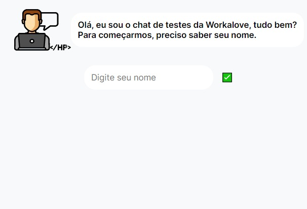

## Iniciando LocalHost
Primeiro, inicie o servidor com os seguintes comandos em seu terminal:

```bash
npm run dev
# or
yarn dev
```

Abra [http://localhost:3000](http://localhost:3000) no seu navegador para ver o resultado.

<h1 align="center">
{ Workana Chat }
</h1>


<br>

<p align="center">
  
 
</p>

## 🚀 Tecnologias

Esse projeto foi desenvolvido utilizando:
- Next.js
- TypeScript
- CSS3
- React.js
- Formik
- Yup
- Axios

## 💻 Projeto

O Workana Chat é um exemplo de chatbot em que o usuário digita seus dados que são pedidos pelo bot e esses dados seram salvos e encaminhados para uma api.

## 🔖 Layout 


